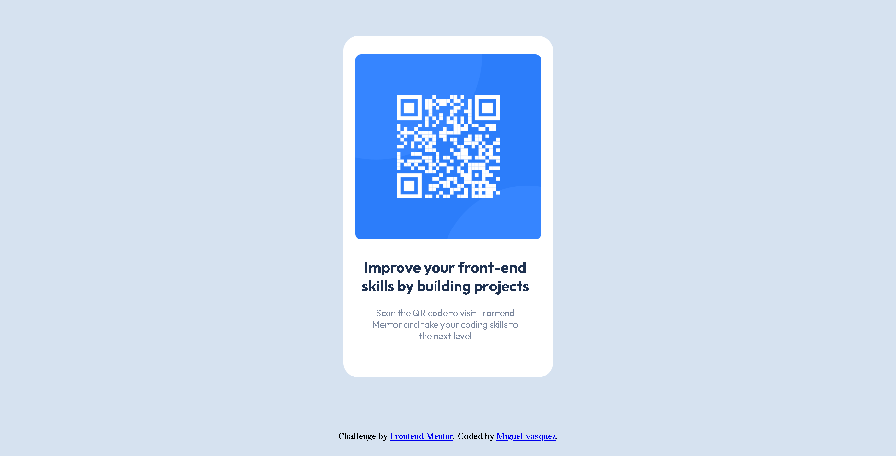

# Frontend Mentor - QR code component solution

This is a solution to the [QR code component challenge on Frontend Mentor](https://www.frontendmentor.io/challenges/qr-code-component-iux_sIO_H). Frontend Mentor challenges help you improve your coding skills by building realistic projects. 

## Table of contents

- [Overview](#overview)
  - [Screenshot](#screenshot)
  - [Links](#links)
- [My process](#my-process)
  - [Built with](#built-with)
  - [What I learned](#what-i-learned)
  - [Continued development](#continued-development)
- [Author](#author)

## Overview

### Screenshot

### Links

- Solution URL: [Add solution URL here](https://your-solution-url.com)
- Live Site URL: [Add live site URL here](https://qr-project-xv.netlify.app)

## My process

### Built with

- Semantic HTML5 markup
- CSS custom properties
- Flexbox
- Mobile-first workflow

### What I learned

I used it to consolidate knowledge in CSS and HTML, in addition to improving my practices

### Continued development

I want to continue the process and focus on JavaScript

## Author

- Website - [Miguel Blog](https://medium.com/@xvvas)
- Frontend Mentor - [@xvvas](https://www.frontendmentor.io/profile/xvvas)
- Twitter - [@xv_vas](https://twitter.com/xv_vas)